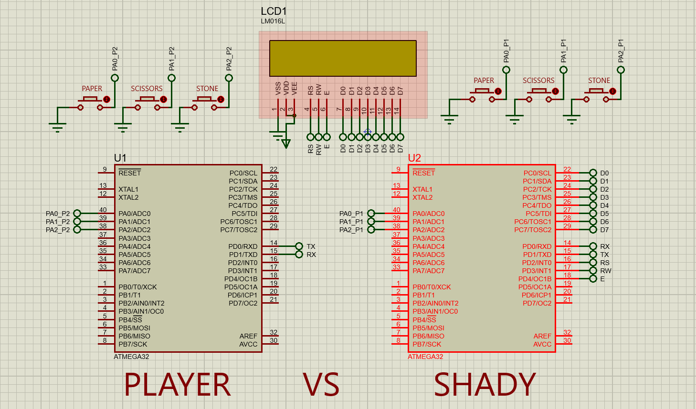

# paper-stone-scissors-game
The two AVRs are connected using UART 

and the AVR and the LCD using i2c

This code is written usuing platformio

You can fing the F_CPU in the platformio.ini file

# Simulation

